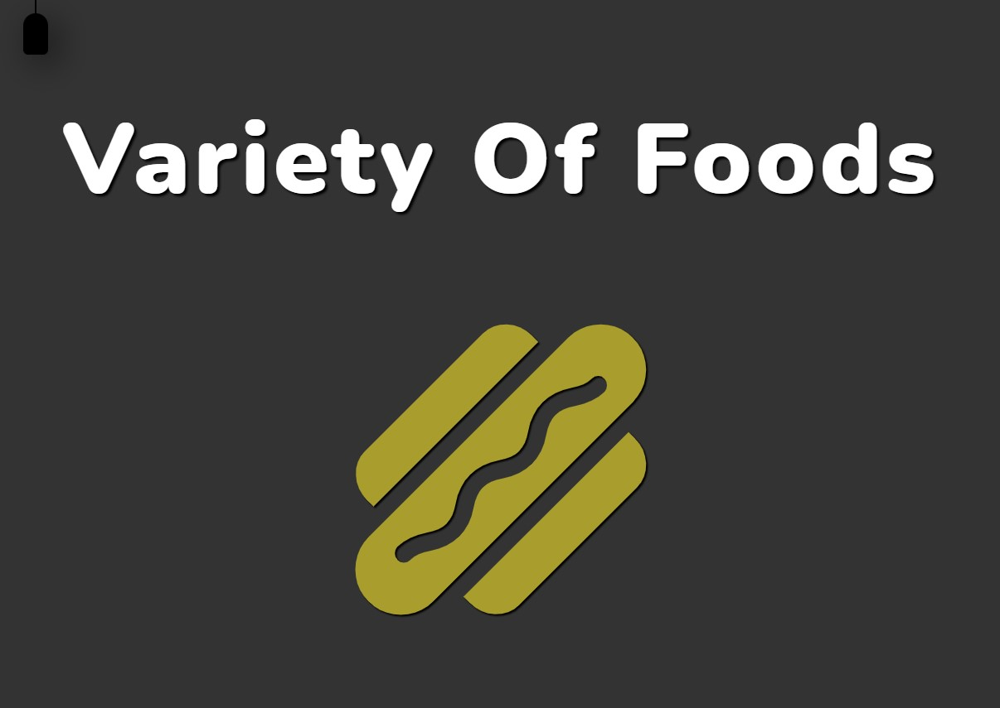
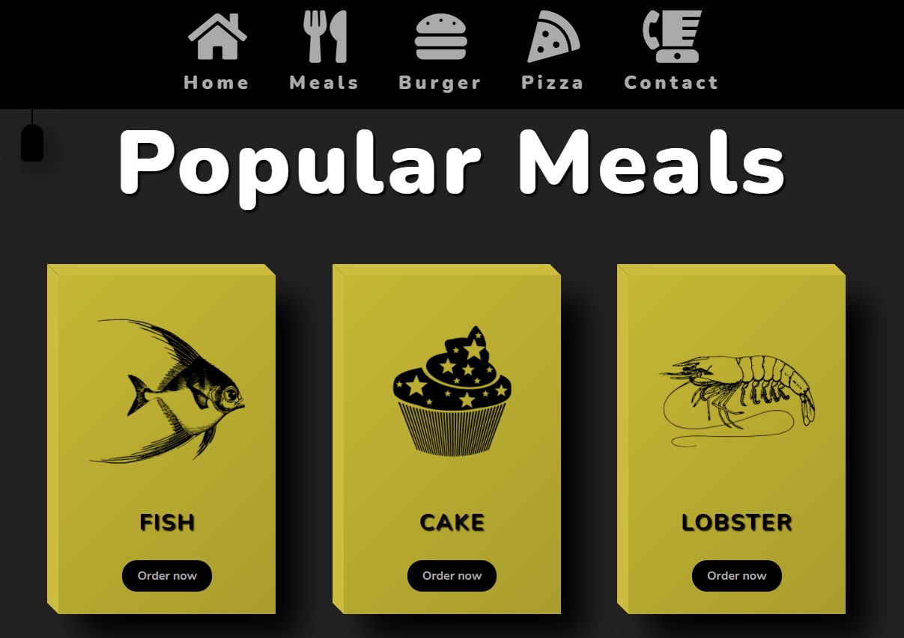
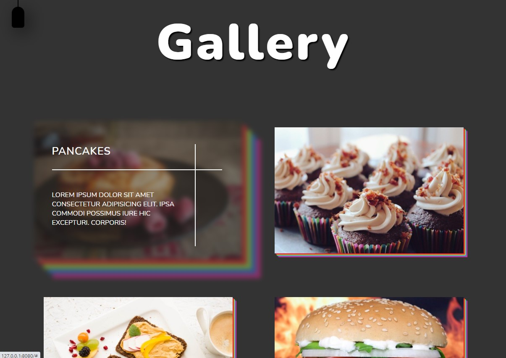

# Website - Foods

[This project](https://gurhanalan.github.io/WebsiteProject-Foods/) is a website of a restaurant displaying their foods.

## Table of contents

-   [Website - Foods](#website---foods)
    -   [Table of contents](#table-of-contents)
    -   [Overview](#overview)
        -   [The challenge](#the-challenge)
        -   [Screenshots](#screenshots)
        -   [Links](#links)
    -   [My process](#my-process)
        -   [Built with](#built-with)

## Overview

### The challenge

Users should be able to:

-   View the optimal layout for the app depending on their device's screen size
-   See hover states for all interactive elements on the page
<!-- -   Change the position, color, shape and size of a box by click the control buttons. -->

### Screenshots

 
 
 

<!--  -->

### Links

-   Solution URL: [Live Website](https://gurhanalan.github.io/WebsiteProject-Foods/)

## My process

### Built with

-   Semantic HTML5 markup
-   CSS custom properties
-   CSS Flexbox
-   Desktop-first workflow
-   Javascript
